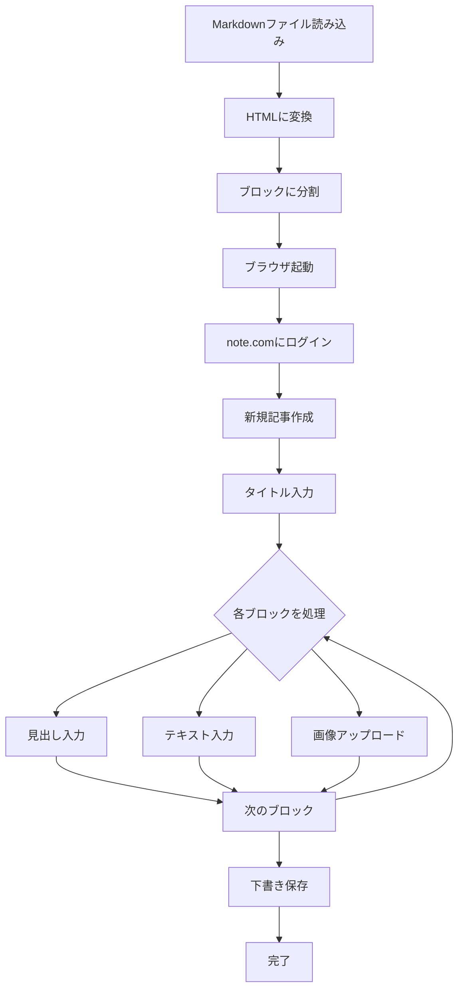

# 技術的実装の詳細

このドキュメントでは、note-md-adapterがどのようにMarkdown記事をnote.comに投稿しているかの技術的な詳細を説明します。

## 背景と課題

### note.comの制約

1. **Markdownの直接貼り付け不可**
   - note.comのエディタはリッチテキストエディタ（WYSIWYGエディタ）
   - Markdownをそのまま貼り付けても、プレーンテキストとして扱われる
   - HTMLを貼り付けても同様にプレーンテキストとして扱われる

2. **画像の一括アップロード問題**
   - 複数画像を選択してアップロードすると、すべて記事の末尾に配置される
   - 記事中の適切な位置に画像を配置するには、1枚ずつ処理が必要

3. **API非公開**
   - note.comは公開APIを提供していない
   - 自動化には別のアプローチが必要

## 解決アプローチ

### 人間の操作を再現する

実際に人間がnote.comで記事を作成する手順を、そのまま自動化することにしました。泥臭いアプローチですが、最も確実な方法です。

**人間の操作手順：**
1. noteにログイン
2. 新規記事作成ページを開く
3. タイトルを入力
4. 本文を段落ごとに入力
5. 画像が必要な箇所で画像をアップロード
6. 下書き保存

## 技術スタック

### Playwright - ブラウザ自動化

```typescript
import { chromium } from 'playwright';

// ブラウザとページを起動
const browser = await chromium.launch({ headless: false });
const page = await browser.newPage();
```

Playwrightを選択した理由：
- モダンなブラウザ自動化ライブラリ
- TypeScriptネイティブサポート
- 認証情報の永続化が容易（Storage State）
- キーボード・マウス操作の詳細な制御が可能

### 認証情報の永続化

```typescript
// 初回ログイン後に認証情報を保存
await context.storageState({ path: '~/.note-md-adapter/auth.json' });

// 2回目以降は保存した認証情報を使用
const context = await browser.newContext({
  storageState: '~/.note-md-adapter/auth.json'
});
```

## コア実装の詳細

### 1. Markdownのパースと分割

```typescript
// MarkdownをHTMLに変換
const html = await remark().use(remarkHtml).process(markdown);

// HTMLを意味のあるブロックに分割
const blocks = [
  { type: 'heading', level: 2, content: 'セクション1' },
  { type: 'paragraph', content: 'これはテキストです。' },
  { type: 'image', src: 'images/photo.jpg', alt: '写真' },
  // ...
];
```

Markdownを一度にすべて処理するのではなく、段落・見出し・画像などの単位に分割して、順番に処理します。

### 2. テキストと見出しの入力

```typescript
// 見出しの入力（Markdown記法で入力）
await page.keyboard.type('## セクション1');
await page.keyboard.press('Enter');

// テキストの入力
await page.keyboard.type('これは本文です。');
await page.keyboard.press('Enter');
await page.keyboard.press('Enter'); // 段落の分離
```

noteのエディタは賢く、`##`のようなMarkdown記法を認識して自動的に見出しに変換してくれます。

### 3. 画像アップロードの実装

最も複雑な部分が画像のアップロードです。

#### クリップボード経由でのペースト実装

```typescript
private async addImage(imagePath: string): Promise<void> {
  // 1. 画像ファイルを読み込み
  const imageBuffer = await fs.readFile(imagePath);
  
  // 2. Base64エンコード
  const base64 = imageBuffer.toString('base64');
  
  // 3. ブラウザ内でClipboard APIを使用してペースト
  await page.evaluate(async ({ base64, mimeType }) => {
    // Base64からBlobを作成
    const response = await fetch(`data:${mimeType};base64,${base64}`);
    const blob = await response.blob();
    
    // ClipboardItemを作成
    const clipboardItem = new ClipboardItem({
      [mimeType]: blob
    });
    
    // クリップボードに書き込み
    await navigator.clipboard.write([clipboardItem]);
    
    // ペーストコマンドを実行
    document.execCommand('paste');
  }, { base64, mimeType: 'image/jpeg' });
}
```

#### カーソル位置の管理

画像をペーストする前に、カーソル位置を正確に制御することが重要です：

```typescript
// 文書の最後尾にカーソルを移動
await page.keyboard.press('Control+End');

// 画像をペースト
await addImage('image.jpg');

// 画像の後にカーソルを移動
await page.keyboard.press('Enter');
```

#### アップロード完了の検出

画像のアップロードは非同期で行われるため、完了を待つ必要があります：

```typescript
// 固定の待機時間（8秒）
await page.waitForTimeout(8000);

// 画像のURLが確定するまで待機
const imageStable = await page.evaluate(async () => {
  const images = document.querySelectorAll('img');
  const lastImage = images[images.length - 1];
  
  // blob:URLではなく、実際のURLになっているか確認
  return lastImage && 
         !lastImage.src.startsWith('blob:') && 
         !lastImage.src.startsWith('data:');
});
```

### 4. 下書き保存

```typescript
// 保存ボタンを探してクリック
const saveButton = await page.waitForSelector('button:has-text("下書き保存")');
await saveButton.click();

// フォールバック: Ctrl+Sショートカット
await page.keyboard.press('Control+s');
```

## 処理フロー



## 技術的な工夫

### 1. Enter キーの管理

- **見出しの後**: 1回のEnter（余分な空行を避ける）
- **テキストの後**: 2回のEnter（段落を確実に分離）  
- **画像の後**: 1回のEnter（余分な空行を避ける）

### 2. エラーハンドリング

- タイトル入力要素が見つからない場合の複数セレクタによるフォールバック
- 画像アップロード失敗時の警告表示
- ログイン失敗時のタイムアウト処理

### 3. ユーザビリティ

- カラフルなコンソール出力（chalk使用）
- 処理状況の詳細な表示
- ヘッドレスモードのオプション提供

## 制限事項と今後の課題

### 現在の制限

1. **公開機能未実装** - 現在は下書き保存のみ
2. **表やコードブロック未対応** - 基本的なテキストと画像のみ
3. **エラー時のリトライなし** - 失敗時は手動で再実行が必要

### 改善の余地

1. **より高速な画像アップロード** - 現在は安全のため長めの待機時間
2. **バッチ処理** - 複数記事の連続投稿
3. **プレビュー機能** - 投稿前の確認機能

## まとめ

note-md-adapterは、APIが提供されていない環境で、人間の操作を忠実に再現することで自動化を実現しています。PlaywrightとTypeScriptの組み合わせにより、堅牢で保守しやすいコードベースを維持しながら、実用的な自動化ツールを提供しています。

泥臭いアプローチですが、確実に動作し、note.comの仕様変更にも柔軟に対応できる設計となっています。